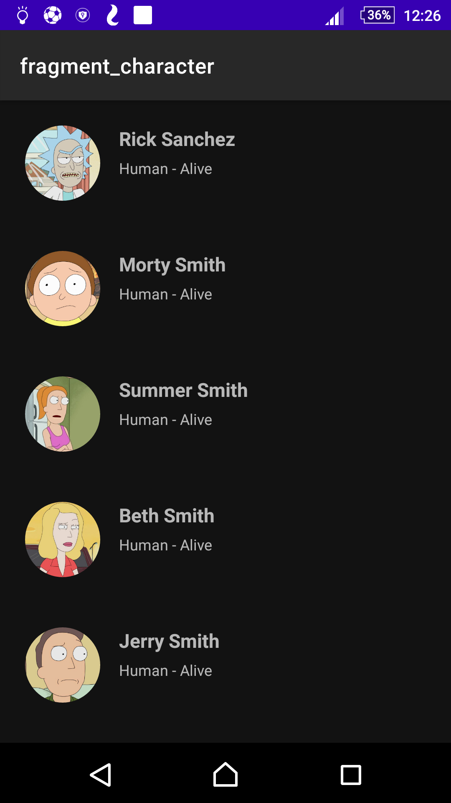

# RickAndMorty - Simple app using Android Architecture 

A Rick And Morty simple app that loads information from [The Rick and Morty API](https://rickandmortyapi.com/) to show one approach to using some of the best practices in Android Development. Including:  
 * ViewModel
 * LiveData
 * Hilt (for dependency injection)
 * Kotlin Coroutines
 * Retrofit
 * Room
 * Navigation
 